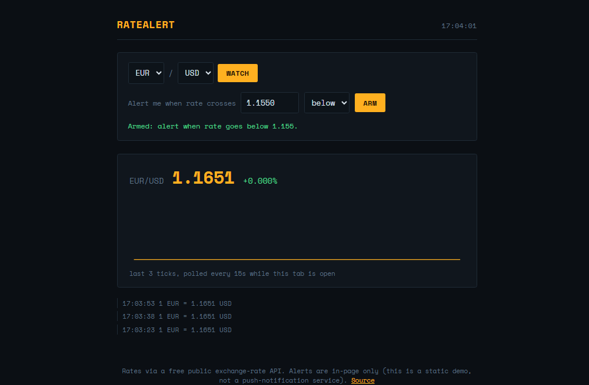

# RateAlert — Real-Time Currency Tracker

A trading-terminal-styled currency tracker: pick a pair, watch a live sparkline build tick by tick, and arm a threshold so you're notified the moment a rate crosses the level you care about.

**[Live demo →](https://arjayb.github.io/RateAlert/)**



## Features

- Live polling (every 15 seconds) of any supported currency pair while the tab is open
- Rolling sparkline chart of the last 40 ticks, rendered in plain SVG — no chart library
- Threshold alerts ("notify me when USD/PHP goes above 58.50") with an in-page log and an optional browser `Notification`
- Terminal-style UI: monospace type, amber ticker display, up/down deltas
- Handles the real edge cases of a public API: unreachable rates and permission-denied notifications, each with a clear fallback
- Zero dependencies — vanilla HTML, CSS, and JavaScript

## Why no backend?

[open.er-api.com](https://www.exchangerate-api.com/) serves live exchange rates over plain HTTPS with CORS enabled, so the browser can poll it directly — no server needed to proxy requests or hide a key, because none is required.

**The trade-off:** this is a static, client-only app, so polling and alerts only run while the browser tab is open. A production version would need a small backend or scheduled worker to keep watching and push alerts once the tab is closed.

**Note on tick freshness:** the free rate API updates roughly hourly upstream, so ticks may repeat the same value between upstream refreshes even though the app polls every 15 seconds — that's expected, not a bug.

## Run it locally

Clone the repo and open `index.html` in a browser. No build step, no `npm install`.

```bash
git clone https://github.com/arjayb/RateAlert.git
cd RateAlert
open index.html   # or just double-click it
```

If your browser blocks `fetch` on the `file://` protocol, serve it with any static server instead:

```bash
python3 -m http.server 8000
# then visit http://localhost:8000
```

## Deploy to GitHub Pages

1. Push this repo to GitHub.
2. Go to **Settings → Pages**.
3. Under **Build and deployment**, set **Source** to `Deploy from a branch`, pick `main` and `/ (root)`.
4. Save — your app will be live at `https://<your-username>.github.io/RateAlert/` within a minute or two.

## Project structure

```
RateAlert/
├── index.html    # markup
├── style.css     # CRT terminal theme, ticker, sparkline layout
├── script.js     # polling loop, sparkline rendering, threshold + notification logic
└── README.md
```

## Data source

All rates come from [open.er-api.com](https://www.exchangerate-api.com/), a free, keyless exchange-rate API. No authentication, no API key, no user data is stored — every tick is a fresh, live request. Alerts are checked entirely client-side against the latest tick.

## License

MIT — use this however you'd like.
